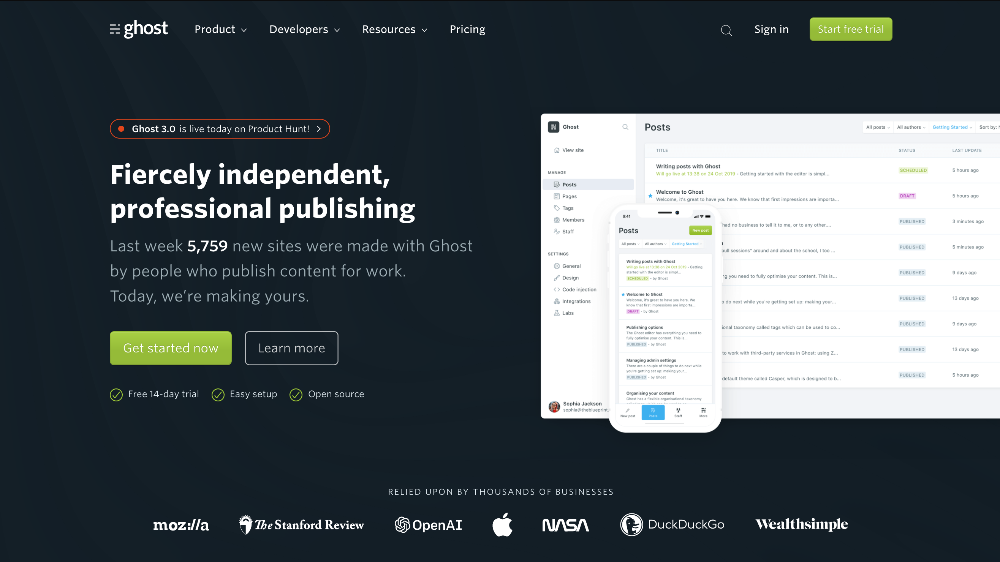
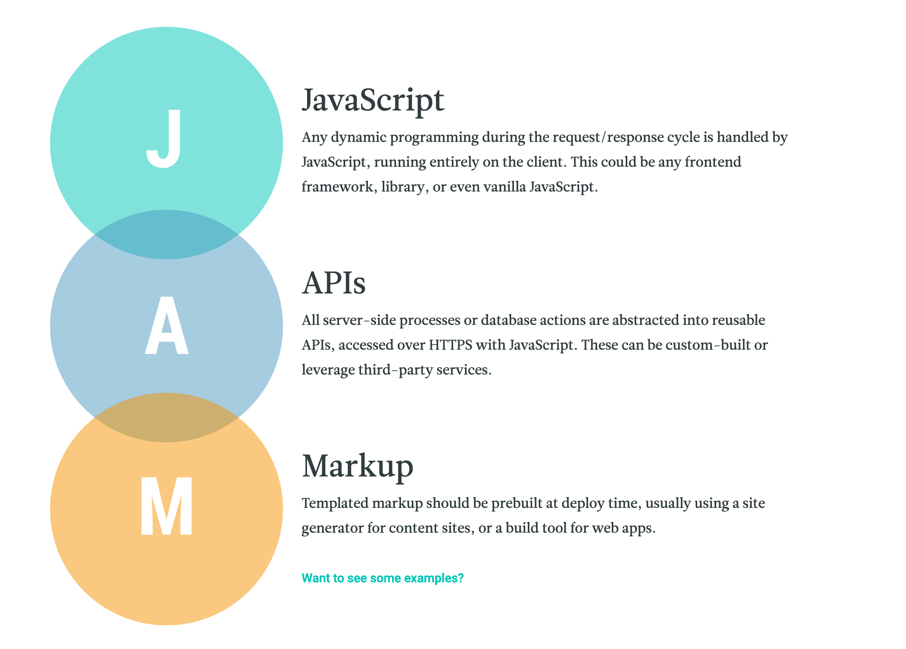

-----------

⚠️ This article is **Work In Progress**

----

Have you ever worked with [WordPress](https://wordpress.com/)? Then you know the pain you have to go through. When it comes to plugins, editors, themes, etc. its hard to get what you want, without in the end having a site that is insecure, slow and hard to maintain. Isn`t there a better solution then this status quo which 34% of all websites use?

> Security is not about "risk elimination", it’s about "risk reduction".

### Modern CMS Systems

Actually, there are a lot of alternatives which are more fun to use, faster and more secure. 

#### Ghost

Ghots is one of the best, if not the best and modern content management system out there. It can not only be used to edit content but can also deliver it for native apps or other applications and can act as a headless cms.

> A Headless CMS is a back-end only content management system built from the ground up as a content  repository that makes content accessible via a RESTful API (or other) for display on any device.

*[ghost.org](https://ghost.org)*

### The JAM Stack

> # A modern architecture, create fast and secure sites and dynamic apps with **J**avaScript, **A**PIs, and prerendered **M**arkup, served without web servers.

The JAM Stack (JavaScript, APIs, Markup) is the most performance way for modern sites and blogs. No searching, no big servers, no external resources, everything is plumbed together when you save content instead of when the user visits your site. So for 1k of visits, you save 999 cycles of work (performance, yeah 🥳) which is the old way of doing it and how WordPress and similar CMS handled it.

*[jamstack.org](https://jamstack.org/)*
